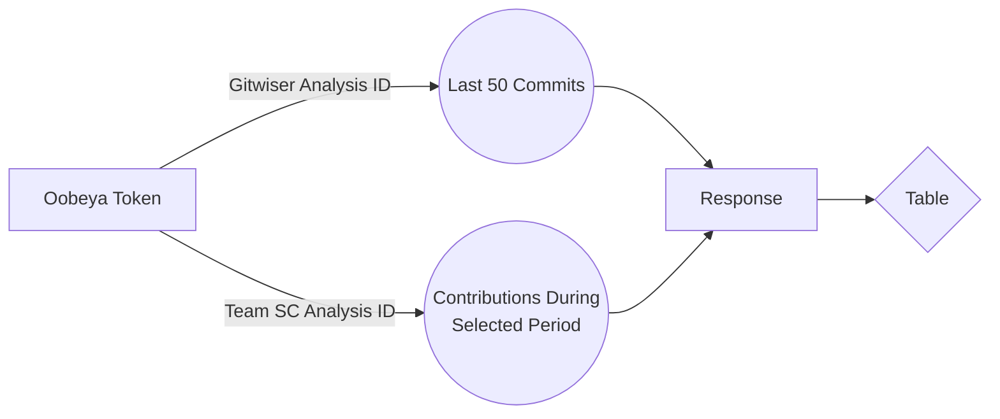

# Welcome to Oobeya!

Oobeya is a new kind of engineering management platform that helps tech leaders to **hear the symptoms of the software development life cycle** with actionable metrics and get complete visibility to diagnose the bottlenecks.

We put the **effectiveness of software development teams** at the center of our vision, analyze by starting from the smallest part of the development activities, and deliver the insight that guides leaders to improve and scale their teams with a **team-friendly** point of view.

# User Guide

## Get Oobeya Token

In oobeya_gitwiser.ipynb, there is a method called  **oobeyaToken()**. According to the parameters that you give in the beginning cell (username,password,URL and so on...),  you have to fill them for your case and you are going to get access token for further operations.

## Get Gitwiser - Last 50 Commits

In oobeya_gitwiser.ipynb, there is a method called  **gitwiserAnalysisLastFiftyCommits(ANALYSIS_ID)**. The ANALYSIS_ID is mandatory area that is nothing but the ID of your gitwiser analysis. You can get it via Inspect > Network > Find **analyses** request.

> **Note:** Assuming that you are on the Gitwiser Page.

## Get Team Scorecard - Contributions During The Selected Period

In oobeya_gitwiser.ipynb, there is a method called  **teamScoreCardContributions(TEAM_ID)**. The TEAM_ID is mandatory area that is nothing but the ID of your team analysis. You can get it via Inspect > Network > Find **scorecards** request.

> **Note:** Assuming that you are on the Team Scorecard page.

# Create Table

In oobeya_gitwiser.ipynb, there is a method called  **createTableForResponse**. The METRIC_TO_SEE is mandatory area that is either "value" or "percent".
The method **createTableForResponse** takes pass the first parameter according to the response that you want to observe. If you want to see Gitwiser - Last 50 Commits , you have to fill it as **gitwiser_resp** , such that, **createTableForResponse(gitwiser_resp, METRIC_TO_SEE)**. Oh the other side, in the case that you want to see Team Scorecard - Contributions During the Selected Period, you have to fill it as **team_scorecard_resp**, such that, **createTableForResponse(gitwiser_resp, METRIC_TO_SEE)**.

# Extra

You can observe the correlation heatmap that is **a graphical representation of a correlation matrix representing the correlation between different variables** by running the last cell.

## Workflow

